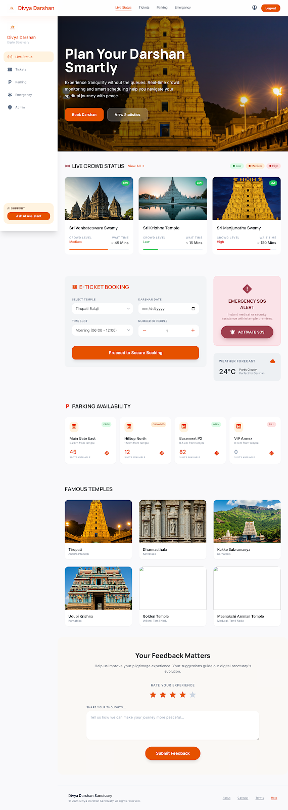
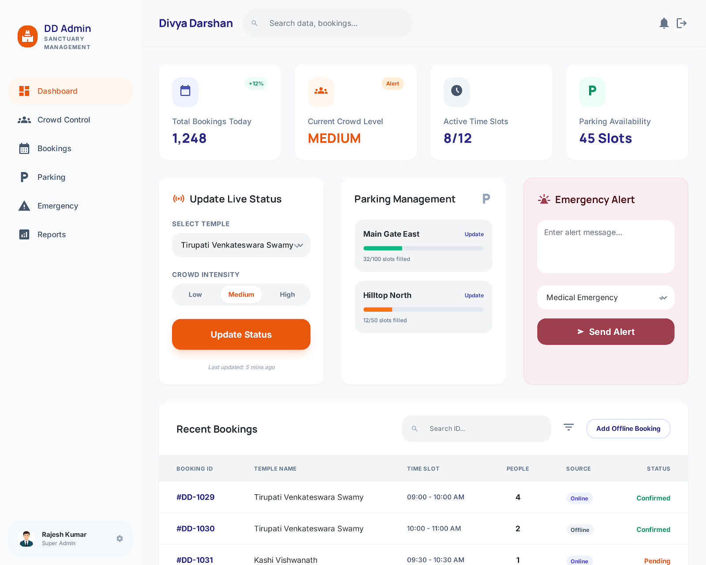
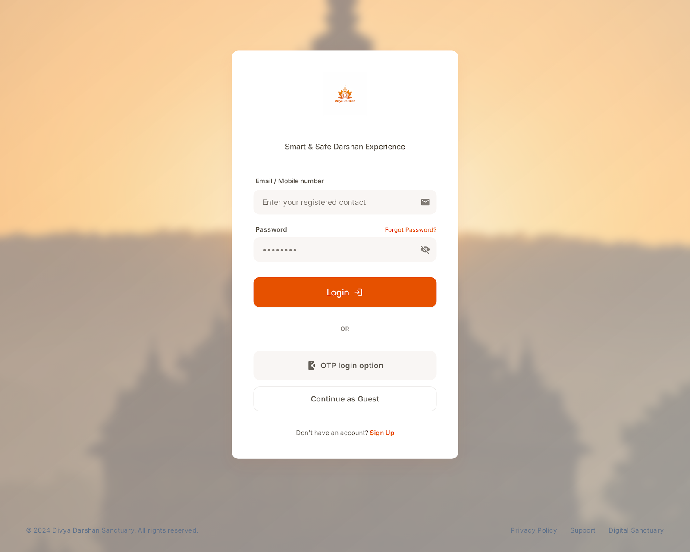
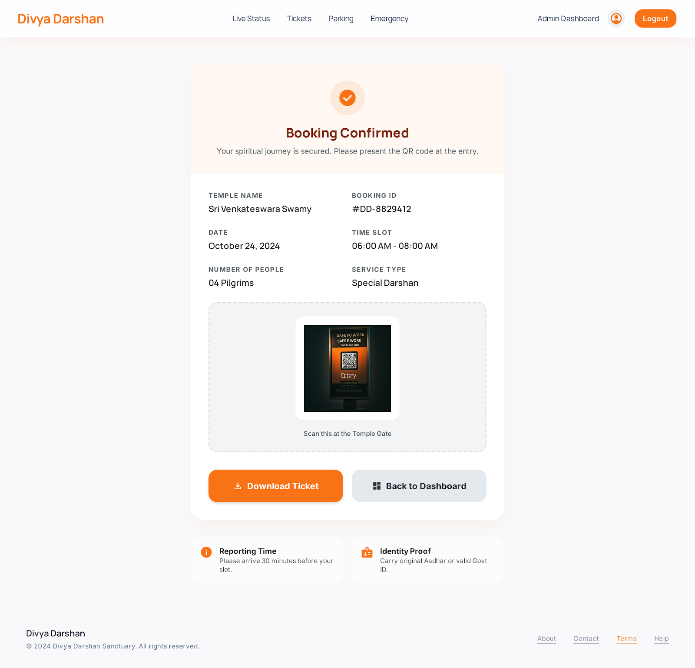

# 🏛️ Divya Darshan — Digital Temple Sanctuary & AI Itinerary Planner

**Divya Darshan** is a premium, high-performance digital sanctuary platform designed to modernize, simplify, and elevate the temple pilgrimage experience in India. It bridges the gap between ancient sacred spaces and modern pilgrims by leveraging real-time AI crowd monitoring, dynamic queuing, interactive parking layout CAD designers, localized multi-page Indic translation systems, and customized spiritual itinerary planners.

---

## 🏛️ Platform Architecture Map

The system is structured into five core specialized client modules communicating with a high-throughput Node.js backend server backed by Supabase SQL, Redis queue middleware, and local JSON backup layers:

```mermaid
graph TD
    subgraph Client Portals
        P[Pilgrim Dashboard: dashboard/index.html]
        L[Spiritual Auth Gate: login/index.html]
        A[Super Admin Dashboard: admin/index.html]
        W[Temple Registration Wizard: register_temple.html]
        S[Custom Microsite Shell: microsite_shell.html]
    end

    subgraph Central Shared Assets
        I18n[Shared Translation Module: shared/i18n.js]
        Theme[Shared Theme Engine: lib/themeUtils.js]
    end

    subgraph Node.js Backend Server
        API[Express API Routes: server.js]
        Queue[Traffic & Queue Middleware: lib/trafficMiddleware.js]
        Daemon[Confirmation & Grace Reminder Daemon: server.js]
    end

    subgraph Storage & Caching Layers
        Redis[(Redis Queue Caching)]
        LocalDB[(Local JSON Databases: data/)]
        Supabase[(Supabase SQL Cloud Backend)]
    end

    subgraph External APIs
        Nodemailer[Nodemailer SMTP Mail Server]
        Leaflet[Leaflet.js Mapping Engine]
    end

    P --> I18n
    L --> I18n
    A --> I18n
    W --> I18n
    S --> I18n

    P --> Theme
    S --> Theme

    Client Portals -- HTTP Requests & Token Auth --> API
    API --> Queue
    Queue --> Redis
    API --> Supabase
    API --> LocalDB
    Daemon --> Supabase
    Daemon --> LocalDB
    Daemon --> Nodemailer
```

---

## 📸 Portal Previews & Screenshots

### 1. Pilgrim Central Dashboard
A visual control center for pilgrims to search sacred temples, check live crowd levels, analyze wait times, purchase tickets, and review AI travel recommendations:


### 2. Super Admin Control Panel
Managing global temple applications, auditing newly submitted registration requests, and configuring concentric/angled parking lot CAD designs:


### 3. Secure Pilgrim Auth Gate
A modern 256-bit encrypted gateway synchronizing tickets, transaction receipts, preferences, and custom profile assets across multiple active sessions:


### 4. Interactive Ticket Checkout Modal
Frosted-glass premium checkout sheets processing VIP/General tickets, prasadam sevas, and accessible parking slot selections seamlessly:


---

## 🌟 Key Product Features & Implementations

### 1. High Visibility Language Selector & Sliced Avatar Profiles
* **Centralized i18n Translation Engine (`shared/i18n.js`)**: Real-time translations in 9 major Indian languages: English (`en`), Hindi (`hi`), Kannada (`kn`), Tamil (`ta`), Telugu (`te`), Malayalam (`ml`), Marathi (`mr`), Bengali (`bn`), and Gujarati (`gu`).
* **High Contrast Toggle**: Built a static white language selector (`text-white border-white/20 hover:bg-white/10`) ensuring universal visibility across all page layouts and gradient headers.
* **Branded Avatar with Custom Uploads**: Displays the elegant brand logo (`../assets/news/logo.png`) on white by default. Pilgrims can tap their avatar to choose and upload custom photos, persisted instantly inside the database as Base64 strings.

### 2. Interactive Admin Parking CAD Designer
* **Absolute Blueprint Grid Concentric concentric slots, angled diagonal rows, EV charging blocks, Accessible (Disabled) spots, standard slots, walkways, and structural pillars.
* **Percentage Scaling Mapping**: The pilgrim dashboard parses admin CAD coordinate templates, automatically drawing interactive slot layouts inside a radial blueprint canvas dynamically.

### 3. Premium Glassmorphic Loader Screens
* **Frosted-Glass Blur Effect**: Upgraded payment and login overlays to use Nawsome's original blue loader spinner (`#1e3f57`, `#3c517d`, `#6bb2cd`) with translucent backdrops (`bg-white/30 backdrop-blur-xl`), eliminating irritating unstyled blank white screens on reload.
* **Minimized Handshake Delays**: Optimized system loader durations down to `100ms` and auth redirects to `300ms` for zero lag transitions.

### 4. Automated Grace Reminders & Timing Worker
* **Auditing Daemon**: Node cron worker checking Supabase databases every 60 seconds.
* **Grace Re-allocation**: Sends styled confirmation notifications exactly 4/6 hours prior to darshans and re-allocates unoccupied seats to waitlist queues after a 30-minute grace window.

---

## 🛠️ Technology Stack & Core Directories

```text
├── admin/                  # Super Admin Dashboard & Parking CAD layouts
├── assets/                 # High-resolution news WebP, JPGs, and SVGs
├── booking/                # VIP & General Booking confirmation views
├── dashboard/              # Pilgrim Dashboard, AI travel tools, registration
│   └── registration/       # Temple self-registration wizard & microsite shells
├── data/                   # Local database JSON backups (temples, users, logs)
├── database/               # SQL schemas (Supabase, tickets, activities)
├── lib/                    # Shared core middleware, theme values, & booking controllers
├── login/                  # Encrypted login & signup gates
├── shared/                 # Central i18n translation maps and styles
├── tests/                  # i18n, booking, theme, and queue automated unit test suites
└── server.js               # Node.js Express server daemon
```

---

## 🚀 Installation & Local Launch

### 1. Prerequisites
Ensure you have **Node.js** (v18 or higher) and **npm** installed.

### 2. Setup Dependencies
Clone the repository and install all required modules:
```bash
npm install
```

### 3. Configure Environment Variables
Create a `.env` file in the root directory based on `.env.example`:
```bash
cp .env.example .env
```
Fill in your Supabase connection strings, email credentials, and secret signing keys:
```env
SUPABASE_URL=your_supabase_url
SUPABASE_KEY=your_supabase_anon_key
JWT_SECRET=your_jwt_signing_secret
SMTP_USER=your_nodemailer_user
SMTP_PASS=your_nodemailer_password
```

### 4. Boot up Server & Development Portal
Run concurrently to boot up the Node API backend server alongside the Vite visual compilation:
```bash
npm run dev
```

### 5. Running the Test Suites
Run the automated test harnesses verifying translations, queue Popping throughput, and layout presets:
```bash
npm run test
```
